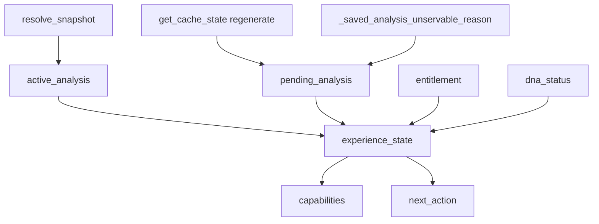
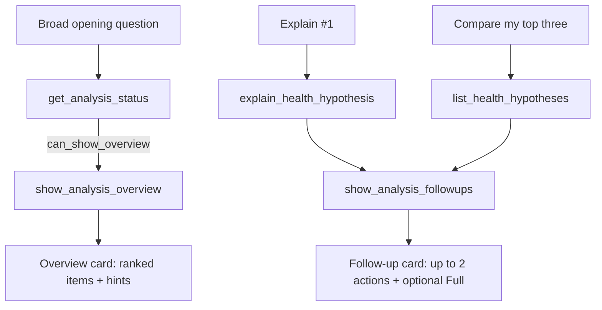

# Mutant MCP contract (3.0.0)

This document describes the implemented contract between the MCP Lambda
(`mutant-mcp`) and the report-generator backend (`report-generator/mcp`). The
backend is authoritative for every business rule and returns the typed `data`
shapes; the Lambda is a thin, authenticated transport that adds only the
MCP-facing presentation (`content`, `suggested_prompts`, widget `_meta`).

Version 3.0.0 is a breaking revision with **no compatibility shims**. The
removed 2.x fields (`analysis_status`, `regenerate`, `regeneration`,
`current_results_usable`, `optional_actions`) no longer exist on the wire, and
the detail tool is named **`explain_health_hypothesis`** (there is no
`get_hypothesis_details` alias).

What changed from 2.0.0:

- One canonical `experience_state` enum plus authoritative `capabilities`,
  replacing the overlapping readiness flags the model had to combine.
- `active_analysis` / `pending_analysis` instead of `analysis` / `regeneration`.
- Every error carries a structured `next_action` object `{tool, reason?,
  arguments?}` — including lifecycle errors, which now never reach a transport
  exception.
- Per-tool typed `outputSchema` (one concrete envelope per tool), so response
  shapes are machine-checkable instead of `record<string, unknown>`.
- Snapshot-consistent cards: `show_analysis_overview` resolves and displays one
  immutable revision (`resolve_analysis_snapshot`), and analytical calls accept
  an optional `analysis_version` pin that is rejected with
  `ANALYSIS_VERSION_CHANGED` on a mismatch.
- A compact follow-up card (`show_analysis_followups` over the internal
  `resolve_analysis_followups` operation) that renders contextual next steps after
  an explanation or comparison, bound to the same revision and authorized ids.

## Transport and authentication

- MCP Streamable HTTP (JSON responses), stateless.
- OAuth 2.1 authorization code with PKCE `S256`.
- `GET /.well-known/oauth-protected-resource[/<resource-path>]` and `GET [<mount>]/.well-known/oauth-protected-resource[/<resource-path>]` — RFC 9728 protected-resource metadata. The custom domain maps `.well-known` to this API, so the document resolves at the host root as well as under the mount key. RFC 9728 locates the document at the resource origin, not by suffixing the resource URI: for resource `https://dev-api.mutantbiotech.com/mcp` the canonical URL is `https://dev-api.mutantbiotech.com/.well-known/oauth-protected-resource/mcp`, and that is the exact URL the `401` challenge advertises. `authorization_servers` lists the MCP host origin — the origin that serves the RFC 8414 document — **not** the Cognito issuer, whose custom domain `404`s the well-known path.
- `GET /.well-known/oauth-authorization-server` and `GET [<mount>]/.well-known/oauth-authorization-server` — authorization-server metadata mirrored from the Cognito OIDC discovery document (ensures `code_challenge_methods_supported: ["S256"]`). Its `issuer` is the MCP host origin, matching the origin serving the document; `authorization_endpoint`/`token_endpoint` remain on the Cognito custom domain, and token `iss` claims are still validated against `MUTANT_OAUTH_ISSUER`.
- Requests without a valid token receive `401` with a `WWW-Authenticate: Bearer resource_metadata="…", error="…", error_description="…"` challenge. A token missing the scope a tool requires receives `403` with `error="insufficient_scope"`.
- Tokens are verified for signature, issuer, expiry, `token_use == "access"`, authorized `client_id`, required scope, and (when the issuer emits one) the resource indicator.
- Identity is `sub` only. **No tool accepts an analysis id, account, or plan.**

### Scopes

One bearer token authorizes one connection, and the connection serves both the
analysis tools and the DNA import flow. Two scopes are supported, and **scope
authorization happens per tool** (see `src/tools/scope-guard.ts`):

| Scope | Granted tools |
|---|---|
| `<resource>/analysis.read` | the nine analysis tools |
| `<resource>/dna.import` | `show_dna_import`, `get_snp_catalog`, `create_report` |

Both are advertised in protected-resource metadata, authorization-server
metadata, every `WWW-Authenticate` challenge, and each tool's
`_meta.securitySchemes`. A token must carry at least one of them to reach the MCP
endpoint; calling a tool whose scope is absent returns `INSUFFICIENT_SCOPE` with
`error.required_scope` set, and the tool-level `_meta["mcp/www_authenticate"]`
challenge advertises that scope so the host re-consents instead of failing
opaquely. `dna.import` is deliberately separate from `analysis.read` because
importing DNA creates user data.

## Envelope

Every tool returns the same envelope as `structuredContent`, plus a single text
content block that summarizes it. `isError` is set from `ok`. Each tool declares
a concrete `outputSchema` built by `envelopeOf(dataSchema)`
(`src/schemas/index.ts`): `data` is typed per tool, `error` is the structured
error, and the schema itself rejects an invalid combination (`ok: true` with an
error, or `ok: false` with data).

```json
{
  "contract_version": "3.0.0",
  "analysis_version": "rev42-v3.0.0",
  "ok": true,
  "data": { "…": "tool-specific" },
  "error": null
}
```

```json
{
  "contract_version": "3.0.0",
  "analysis_version": null,
  "ok": false,
  "data": null,
  "error": {
    "code": "PLAN_REQUIRED",
    "message": "This request is outside your Free top-three analysis.",
    "retryable": false,
    "required_plan": "mutant_full",
    "upgrade_url": "https://mutantgenomics.com/upgrade?source=chatgpt",
    "next_action": {
      "tool": "get_analysis_context",
      "reason": "Continue with the accessible top three."
    }
  }
}
```

- `analysis_version` is opaque. It changes when returned content changes (account
  cache revision + scoring config version). It is set on every analytical
  envelope and `null` on non-analysis tools (DNA import, catalog, overview
  pre-resolution failures).
- `error.next_action` is the structured `{tool, reason?, arguments?}` object for
  **every** error, not only `get_analysis_status`. It is the only sanctioned way
  for the model to recover; the transport never converts a lifecycle state into a
  thrown exception.
- `error.reason` is present only for readiness diagnostics
  (`core.cache_identity.REASON_*`), never as free-form prose.

### `content` is a deterministic summary, not a JSON mirror

The single text block is assembled from the typed `data` by
`src/presentation/content.ts`, one builder per tool, within the contract's
per-tool budgets (status ≈ 80–500 chars; context ≈ 400–1,200; list ≈ 150–900;
details ≈ 700–2,500; evidence/genetic context ≈ 300–2,000). It **never**
serializes `structuredContent`, never leaks the envelope, and never contains
genotypes except where the tool legitimately returns markers
(`get_genetic_context`). Human-facing scores are rounded in prose; full
precision stays in `data`. Errors render as a short code/message/next-action
block without the envelope.

For `PROCESSING_INITIAL` and `REFRESH_PROCESSING_NO_USABLE_ANALYSIS` the content
is exactly one non-instructional sentence — `Analysis is processing.` and
`Analysis refresh is processing.` — on both the model-facing and component-owned
paths. No next-action hint, call to action, or future-capability claim appears.

### `_meta` is widget-only

`_meta` carries only the auth challenge (`mcp/www_authenticate`), the Apps SDK
UI descriptor, the security schemes, and widget hydration state (`mutant.mode`,
and `mutant.displayed_analysis_version` for the overview card; the follow-up card
adds `mutant.intent`). No tool data,
genotypes, or account state is placed in `_meta`.
When `experience_state` is `READY_REFRESH_AVAILABLE` or
`READY_REFRESH_PROCESSING`, the `get_analysis_status` result also carries the
shared UI descriptor and widget-only `mutant.mode: "overview"`, so the refresh
card opens with findings and hints without a second tool call.

## Experience state model

`report-generator/mcp/state.py` is the **single source of truth**. Nothing else
in either repo recomputes `experience_state`, `active_analysis`,
`pending_analysis`, or `capabilities`; the Apps SDK card and the analytical tools
read the same derivation, which is what stops them from disagreeing about
whether results are usable.



Derivation rules:

- `active_analysis.status = "ready"` (with `analysis_version`, `generated_at`,
  optional `scoring_engine_version`, and `usable: true`) only when the saved
  causes payload the read tools require is servable. Otherwise it is
  `{ "status": "none", "usable": false }`.
- `pending_analysis` is present when the snapshot is `processing`/`failed`, when
  `regenerate` is set alongside an in-flight refresh, or when the saved payload is
  transiently unservable (a regeneration still writing). Its `reason` is
  `initial_analysis`, `platform_refresh`, or `user_refresh`.
- `experience_state` is the finite UX vocabulary below.
- `capabilities.can_query_analysis` equals `active_analysis.usable` — by
  construction, not by convention.

### `experience_state`

| State | Meaning |
|---|---|
| `NO_DNA` | No DNA has been imported. |
| `PROCESSING_INITIAL` | First analysis in flight; no prior usable results. |
| `READY` | Usable results, nothing to refresh. |
| `READY_REFRESH_AVAILABLE` | Usable results, and a newer platform/scoring revision is available. |
| `READY_REFRESH_PROCESSING` | Usable results while a replacement run is in flight. |
| `REFRESH_PROCESSING_NO_USABLE_ANALYSIS` | A replacement run is genuinely in flight and no usable results exist yet. |
| `PROCESSING_FAILED` | No usable results and nothing in flight (terminal failure or an unservable payload with no writer); regeneration is required. |

Add a state only when it changes ChatGPT behavior.

A processing state requires a run that is actually in flight (`snapshot.status` or
`snapshot.refresh_status` is `processing`). The `regenerate` freshness flag alone
means a newer revision exists — not that anything is writing the payload — so it
never creates a processing state. A transiently unservable payload on a completed
report therefore yields `PROCESSING_FAILED` with the regeneration action, because
polling could never clear it. `pending_analysis.retry_after_seconds` gives a
genuinely in-flight run a bounded cadence.

### `capabilities`

| Flag | True when |
|---|---|
| `can_query_analysis` | `experience_state` is one of the `READY*` states (equals `active_analysis.usable`). |
| `can_show_overview` | Same as `can_query_analysis`. |
| `can_refresh_analysis` | `experience_state == READY_REFRESH_AVAILABLE`. |
| `can_search_hypotheses` | `can_query_analysis` and the account is Full. |
| `can_explore_genetic_context` | Same as `can_query_analysis`. |

### `next_action`

`next_action` is present only when exactly one logical path exists. In the READY
states it is deliberately omitted: the user may open the overview, ask a
question, or browse, so pinning one action would over-constrain the model.

| State | `next_action` |
|---|---|
| `NO_DNA` | `show_dna_import` (`arguments: {mode: "initial"}`). |
| `PROCESSING_INITIAL` | `get_analysis_status` (poll). |
| `REFRESH_PROCESSING_NO_USABLE_ANALYSIS` | `get_analysis_status` (poll). |
| `PROCESSING_FAILED` | `show_dna_import` (`arguments: {mode: "regenerate"}`). |
| DNA on file, no report row | `show_dna_import` (`arguments: {mode: "initial"}`). |
| `READY*` | omitted. |

The backend always emits the polling `next_action` for a processing state only
when a run is genuinely in flight. The Lambda strips it only on the
component-owned `poll_analysis_status` path, where the card polls on its own and
the hint would only invite the model to poll or narrate. The model-facing
`get_analysis_status` keeps it for the non-UI path, paired with
`pending_analysis.retry_after_seconds` so the caller has a cadence rather than a
hot loop. When no usable analysis exists and no run is in flight, there is no
polling hint at all: the state is `PROCESSING_FAILED` and the only action is the
regeneration via `show_dna_import` `{mode: "regenerate"}`.

## Tools

Each tool maps to a distinct user goal. The routing contract is:

| Tool | Responsibility |
|---|---|
| `get_analysis_status` | Establish connection, DNA readiness, the canonical `experience_state`, entitlement, capabilities, and the single next action. Model-facing. |
| `poll_analysis_status` | App-only (`app` visibility) status read used by the DNA import component while it owns the processing experience. Same payload as `get_analysis_status`, minus polling hints and suggested prompts. |
| `show_analysis_overview` | Resolve one immutable analysis snapshot and open the ready-analysis Apps SDK card bound to it. Model-facing; the deliberate render tool for broad opening questions. |
| `show_analysis_followups` | Verify and open the compact Apps SDK follow-up card after an explanation or comparison, bound to the same revision and hypothesis ids. Model-facing; the only render tool for the follow-up card. |
| `get_analysis_context` | Supply the interpretation contract, coverage, access scope, a compact top-hypothesis preview, and useful next questions for specific analysis questions. |
| `list_health_hypotheses` | Browse, search, sort, paginate, and compare accessible hypotheses. |
| `explain_health_hypothesis` | Explain one hypothesis in depth. |
| `get_supporting_evidence` | Expand one evidence category for one hypothesis. |
| `get_genetic_context` | Answer marker-, gene-, or module-level questions. |

Call `get_analysis_status` first. Read its `experience_state` and `capabilities`
instead of inferring readiness. When `experience_state` is `NO_DNA`, call
`show_dna_import` in the same turn. For any broad opening question ("What are my
top hypotheses?", "What did Mutant find?", "Show my results", or a general
overview), when `capabilities.can_show_overview` is true, call
`show_analysis_overview` in the same turn and let the card present the ranked
findings and hints. A broad opening question is **never** answered with
`list_health_hypotheses` and never with a prose list of the same findings. For a
specific question, call `get_analysis_context` first, then use
`list_health_hypotheses` for subsequent browsing, searching, sorting,
pagination, and comparison; use `explain_health_hypothesis` or
`get_supporting_evidence` for a single finding. After an explanation or a
comparison, when the host supports Apps SDK UI, call `show_analysis_followups`
once with the same `analysis_version` and the ids the answer covered; the answer
itself stays in the conversation and is never restated by the card.



Both `list_health_hypotheses` and `explain_health_hypothesis` (plus
`get_supporting_evidence` and `get_genetic_context`) accept an optional
`analysis_version` snapshot pin. Omit it to answer against the currently active
analysis; pass the value a card or prompt suggestion displayed to bind the call
to that exact revision. A mismatch is rejected with `ANALYSIS_VERSION_CHANGED`
(see [Snapshot consistency](#snapshot-consistency)).

### Pre-message entry prompts

Three prompts can open a fresh conversation before any Apps SDK card exists:

- `Which of my Mutant findings best fits the health history or records I've shared here?`
- `Show my current Mutant findings.`
- `Help me add my DNA data to Mutant.`

They are published as the packaged plugin's
`extensions.com.openai.interface.defaultPrompt` (comparison first) in
`plugin.json`, and the connector description states the same first question for
surfaces without a starter-prompt field. Every one of them calls
`get_analysis_status` first (readiness is unknown), then follows
`experience_state` and `capabilities`:

- A ready broad-results prompt opens `show_analysis_overview` (exactly one card in
  the same turn).
- A ready comparison prompt uses the accessible findings and only the health
  history or records actually present in the ChatGPT conversation; when none were
  shared it asks what the user wants to share and never implies records access.
  The user's history prose is never passed as the `list_health_hypotheses.query`
  argument — only catalog-topic keywords reach search tools.
- `NO_DNA` opens `show_dna_import`.
- A processing state shows only the current processing experience, with no
  promised future results and no extra polling instructions.

### `get_analysis_status`

Input: `{}`. A successful call even with no analysis.

```json
{
  "dna_status": "available",
  "experience_state": "READY_REFRESH_AVAILABLE",
  "active_analysis": {
    "status": "ready",
    "analysis_version": "rev41-v3.0.0",
    "generated_at": "2026-08-01T12:00:00Z",
    "scoring_engine_version": "v3.1.0",
    "usable": true
  },
  "pending_analysis": null,
  "entitlement": {
    "plan": "mutant_free",
    "hypothesis_scope": "top_three",
    "genetic_context_scope": "accessible_hypotheses"
  },
  "capabilities": {
    "can_query_analysis": true,
    "can_show_overview": true,
    "can_refresh_analysis": true,
    "can_search_hypotheses": false,
    "can_explore_genetic_context": true
  },
  "next_action": {
    "tool": "show_dna_import",
    "reason": "Resubmit DNA to regenerate the analysis with the current scoring engine.",
    "arguments": { "mode": "regenerate" }
  },
  "suggested_prompts": [ /* added by the Lambda, max 5 */ ],
  "upgrade": { "label": "Unlock Full Analysis", "url": "https://mutantgenomics.com/upgrade?source=chatgpt" }
}
```

- `dna_status` is `missing | available`. `missing` means no DNA data has been
  received, so `show_dna_import` is the next action.
- `experience_state` is the canonical enum. The internal `none` readiness word
  never appears on the wire.
- `active_analysis` is the analysis that can be queried **now**:
  `{ status: "none" | "ready", analysis_version?, generated_at?,
  scoring_engine_version?, usable }`. Version fields are resolved only for a
  servable analysis.
- `pending_analysis` is `null` or
  `{ status: "processing" | "failed", reason: "initial_analysis" |
  "platform_refresh" | "user_refresh", target_scoring_engine_version?, failure? }`.
  `failure` is `{ code, message }` and appears only for a `failed` replacement.
- `entitlement` is the effective plan and scope.
  `genetic_context_scope` is `accessible_hypotheses` for Free and
  `all_analyzed_markers` for Full. `access_expires_at` is present only when
  access is scheduled to end (never a renewal date).
- `capabilities` mirrors the state model above.
- `upgrade` is present only for a Free account with locked findings.
- There is no `regenerate`, `regeneration`, `current_results_usable`,
  `optional_actions`, or `analysis_status` field. Readiness is expressed exactly
  once, by `experience_state`.

The status endpoint reports readiness from what the read tools can actually
serve, not merely from report completion. A completed run whose saved causes
payload is missing, stale, or from a different scoring engine is never
advertised as `READY` while `get_analysis_context` would refuse it: it is
`REFRESH_PROCESSING_NO_USABLE_ANALYSIS` only while a run is actually writing the
replacement, and `PROCESSING_FAILED` (regeneration required) otherwise.

While `experience_state` is a processing state, the DNA import component polls
its own app-only `poll_analysis_status` tool (about every 7 seconds, up to 10
minutes) after it creates a report; this tool is the model-facing path. In the
two no-usable-analysis processing states the published instructions forbid
calling any analysis, overview, hypothesis, evidence, or genetic-context tool,
describing or speculating about future capabilities, enumerating future genes,
modules, rsIDs, variants, hypotheses, scores, or patterns, starting an assistant
polling loop, or narrating the state while the component is on screen. An
explicit question about what is happening is answered briefly from the payload
alone; silence is preferred over describing unavailable capabilities.

#### Refresh semantics

- `READY_REFRESH_AVAILABLE` means the platform/catalog/scoring revision is newer
  than the account's, **and** the current results remain usable. It is never
  inferred from the mere existence of a report. The refresh action is
  `show_dna_import` with `{mode: "regenerate"}`.
- `READY_REFRESH_PROCESSING` means a replacement run is in flight while the prior
  results stay queryable. No refresh action is offered while a run is in flight.
- `REFRESH_PROCESSING_NO_USABLE_ANALYSIS` is the same run with no usable prior
  results but a run actually writing a replacement; the only action is to poll
  status, with `retry_after_seconds` as the cadence. A `regenerate` flag with no
  run in flight is not this state.
- A refresh requires DNA resubmission: the platform cannot rescore a stored raw
  file the account no longer holds.
- A permanent miss (`analysis_engine_changed`, `analysis_payload_empty`) makes
  the active analysis unusable and yields `PROCESSING_FAILED` with a regeneration
  action; a transient miss clears on its own only while a run is writing the
  replacement. With no writer it also yields `PROCESSING_FAILED`, because waiting
  cannot clear it.

### `poll_analysis_status`

Input: `{}`. The component-owned counterpart of `get_analysis_status`, advertised
with `app` visibility only, so it never appears in the model's tool list.

It performs the same backend read (`get_analysis_status`) and returns the same
typed `data`, with two deterministic differences:

- the polling `next_action` is removed in `PROCESSING_INITIAL` and
  `REFRESH_PROCESSING_NO_USABLE_ANALYSIS`; and
- `suggested_prompts` is never attached (the card renders completion prompts from
  `get_analysis_context` once results exist, not from a processing payload).

Because tool identity is the ownership signal, the presence of
`poll_analysis_status` is what proves the component owns polling. It never
changes the payload in a ready, failed, or no-DNA state.

### `get_analysis_context`

Input: `{}`. The first analysis tool called after status reports
`can_query_analysis`. It bootstraps the overall experience: the versioned
interpretation contract, coverage, access scope, a compact preview of the top
three hypotheses, and next-question prompts. It is not a listing tool.

```json
{
  "interpretation": {
    "version": "2.6",
    "purpose": "Mutant returns ranked, genetically supported health hypotheses for exploration and clinical discussion, not diagnoses.",
    "response_rules": ["… (1-6)"],
    "evidence_explanation_rules": {
      "organizing_level": "modules_then_patterns_then_variants",
      "rules": ["… (1-15)"],
      "module_first_instruction": "When explaining a hypothesis, do not begin with a gene or SNP. First state whether support is multi-module, single-module, pattern-led, or concentrated in one locus. Explain the contributing modules and retained patterns next. Mention individual genes and variants only after their actual scoring route is clear. If one driver dominates, disclose that concentration prominently."
    },
    "score_semantics": {
      "priority_score": "…",
      "genetic_support": "…",
      "assessment": "…",
      "genetic_evidence": "…",
      "genetic_confidence": "…",
      "coverage_confidence": "…",
      "marker_coverage": "…",
      "assessability": "…",
      "pattern_convergence": "…",
      "module_support": "Genetic support from the underlying biological modules.",
      "pattern_support": "Additional retained support from cross-module patterns, comparable to module_support on the same 0-100 scale."
    },
    "evidence_boundaries": {
      "genetics_is_not_diagnosis": true,
      "genetic_support_does_not_establish_current_status": true,
      "clinical_correlation_is_catalog_guidance": true,
      "clinical_correlation_is_not_user_record_evidence": true
    },
    "health_context_usage": {
      "allowed": true,
      "performed_by": "chatgpt",
      "sent_to_mutant": false,
      "purpose": "relevance_filtering"
    },
    "presentation_order": [
      "bottom_line",
      "support_architecture",
      "module_contributions",
      "pattern_contributions",
      "key_scoring_genes_and_variants",
      "interpretation_boundary",
      "minimal_confirmation",
      "strengthening_and_weakening_evidence",
      "action_changing_guardrail"
    ],
    "limitations": ["…", "…"],
    "evidence_model": {
      "primary_units": ["modules", "patterns", "variants"],
      "preferred_explanation_order": ["modules", "patterns", "variants"]
    }
  },
  "coverage": { "analyzed_markers": 1240, "classification": "moderate" },
  "access": {
    "plan": "mutant_free",
    "hypothesis_scope": "top_three",
    "total_ranked": 12,
    "returned": 3,
    "unlocked": 3,
    "locked": 9,
    "scope_message": "Your top three ranked hypotheses are fully unlocked. Mutant Full can search 9 additional ranked hypotheses."
  },
  "preview": [ /* up to three HypothesisSummary, rank order */ ],
  "upgrade": { "label": "Unlock Full Analysis", "url": "https://mutantgenomics.com/upgrade?source=chatgpt" },
  "suggested_prompts": [ /* added by the Lambda, max 5 */ ]
}
```

- `interpretation` is server-owned and versioned (`"2.6"`). It is global product
  behavior, never per-hypothesis catalog prose and never LLM-generated.
  `response_rules` is 1-6 unique strings; `limitations` is 0-4 unique strings;
  the boundary flags are literal `true`; `score_semantics` has exactly the
  published keys (`priority_score`, `genetic_support`, `assessment`,
  `genetic_evidence`, `genetic_confidence`, `coverage_confidence`,
  `marker_coverage`, `assessability`, `pattern_convergence`, `module_support`,
  `pattern_support`);
  `presentation_order` is the fixed order above; `evidence_model` names the
  evidence units explanations are built from.
- `evidence_explanation_rules` is the module-first contract: `organizing_level`
  is `modules_then_patterns_then_variants`, `rules` carries the published
  presentation rules, and `module_first_instruction` is the stable server
  instruction the model must apply to every hypothesis explanation. It is global
  behavior, not per-hypothesis content, and is never echoed into `content`.
- The blocks are named `interpretation`, `access`, and `preview` (2.0.0 called
  them `interpretation_contract`, `access_summary`, and `top_hypotheses`).
- `coverage.classification` is optional.
- `access.hypothesis_scope` is `top_three` for Free and `all` for Full.
  `unlocked` is the count of accessible hypotheses; `locked` is the count the
  current plan cannot reach (zero for Full). `scope_message` states the actual
  scope and never implies the three previews are the whole of a Full analysis.
- `upgrade` is present only for a Free account whose analysis has `locked > 0`.
  Full never receives upgrade messaging.
- Free never exposes locked hypothesis ids, names, scores, ranks, or tags.

For Full, `scope_message` reads: "Your complete ranked analysis is available.
This response previews the top three; use hypothesis search or listing to
explore the rest."

#### `HypothesisSummary`

The shared browse/search DTO, reused (bounded to three records in rank order) by
the context `preview`:

```json
{
  "id": "RC_A",
  "rank": 1,
  "name": "Alpha",
  "summary": "…",
  "priority_score": 90.0,
  "genetic_support": 80.0,
  "genetic_confidence": { "score": 82.5, "level": "high" },
  "genetic_evidence": "strong",
  "coverage_confidence": "high",
  "pattern_convergence": "strong"
}
```

- `name` is the display name (2.0.0 called it `title`); `summary` is the curated
  `presentation.bottom_line` when present, else the catalog `summary` or the
  hypothesis `user_description`.
- `genetic_evidence`, `coverage_confidence`, and `pattern_convergence` pass the
  engine's published vocabulary through unchanged. No thresholds or scores are
  invented.
- `genetic_support` is the raw support score; `genetic_confidence` is
  `{ score, level }` and describes measurement quality, independent of direction.
- `priority_score` is a ranking signal, **not** disease probability or diagnostic
  confidence, and is not comparable across analyses.

#### Model-facing `content`

`get_analysis_context` `content` is deterministic prose, never JSON:

```text
Your DNA analysis is ready and assessed {analyzed_markers} markers. {purpose}

Your highest-ranked findings are:
1. {name} - {summary}
2. {name} - {summary}
3. {name} - {summary}

{scope_message}

{first limitation}

You can ask me to explain one finding, compare the three, or search accessible hypotheses by topic.
```

It carries the readiness/coverage sentence, the access scope, the preview list,
the single most important interpretation boundary, and the next-question line.
It never repeats the full contract, never serializes `structuredContent`, and
stays under ~1,500 characters (names and summaries are bounded).

### `list_health_hypotheses`

Input: `{ query?, limit? (1-20, default 10), cursor?, analysis_version? }`.
`query` is a catalog-topic keyword only (never the user's health-history prose)
and matches the hypothesis name, summary, plain-language summary, and type.

Output:

```json
{
  "items": [ /* HypothesisSummary[] */ ],
  "next_cursor": "…",
  "total_accessible": 12,
  "search_scope": {
    "hypothesis_scope": "top_three",
    "searched_count": 3,
    "total_ranked_count": 92,
    "unsearched_ranked_count": 89,
    "query_outcome": "no_match_in_accessible_scope",
    "broader_ranked_search_available": true
  }
}
```

`next_cursor` is present only when more items remain; there is no `page`
wrapper. `total_accessible` is optional. Free returns its frozen top three in
rank order; Full returns the whole set.

`search_scope` is on every successful list response. It is authored by the
backend from the same entitlement and ranked snapshot used for filtering, so the
MCP layer never guesses the counts:

- `hypothesis_scope` is `top_three` for Free and `all` for Full, mirroring the
  `get_analysis_status` `entitlement.hypothesis_scope` vocabulary.
- `searched_count` is the accessible hypotheses searched, `total_ranked_count`
  the ranked hypotheses in the analysis, and `unsearched_ranked_count` the
  difference (`0` for Full).
- `query_outcome` is set only for a nonempty catalog-topic `query` whose
  **first page** has zero matches across the applicable scope — never for an
  unfiltered list or an empty later page. Free reports
  `no_match_in_accessible_scope`; Full reports `no_match_in_ranked_search_fields`.
- `broader_ranked_search_available` is true only when Free has locked findings
  (`unsearched_ranked_count > 0`); it is false for Full and for a Free analysis
  with nothing locked.

A Free empty search means only that the accessible top three did not match. It
never states whether the topic appears in the locked ranked set, and a query that
matches a locked finding is indistinguishable from one that matches nothing
anywhere: locked names, ids, ranks, scores, and per-query matches are never
searched or disclosed. The outcome is tied to the catalog search fields above,
not to every biological evidence layer. This is a successful response within
scope, not a `PLAN_REQUIRED` error, and it carries no `upgrade` offer.

#### Model-facing `content`

The list `content` is deterministic prose. For a zero-result catalog-topic
search the builder renders the scope instead of "No health hypotheses matched.":

```text
No matching hypothesis was found among the three findings searchable with Mutant Free.
This result cannot tell whether the topic appears elsewhere in the ranked analysis.
Mutant Full allows searching the complete ranked set.
```

- "three" is rendered from `searched_count`; the user's total ranked count is
  never stated and the patient-specific query is never echoed.
- The wider-search sentence is included only when
  `broader_ranked_search_available` is true, so a Free analysis with nothing
  locked does not suggest a broader search.
- For Full (`no_match_in_ranked_search_fields`) the content is exactly
  `No ranked hypothesis matched in the catalog search fields.` — it never claims
  the user lacks a related variant, a genetic signal, or a health condition.
- With no `query_outcome` (an unfiltered list or an empty later page) the content
  stays `No health hypotheses matched.`

### `explain_health_hypothesis`

Input: `{ hypothesis_id, analysis_version? }`. The explanation-ready projection,
with no nested variant records, no full test records, and no bespoke prose. It is
organized module-first: the server states whether support is broad or
concentrated, then the contributing modules, then retained patterns, then the key
scoring drivers.

```json
{
  "hypothesis": {
    "id": "RC_A",
    "rank": 1,
    "name": "Alpha",
    "assessment_state": "assessed",
    "scores": {
      "priority": 90.0,
      "genetic_support": 80.0,
      "genetic_confidence": { "score": 82.5, "level": "high" },
      "coverage": "high",
      "convergence": "strong"
    }
  },
  "bottom_line": "…",
  "evidence_shape": {
    "support_distribution": "concentrated",
    "summary": "Support is concentrated: CYP19A1 supplies 71% of the retained genetic support."
  },
  "explanation": {
    "bottom_line": "…",
    "why_ranked": "It ranked #1 on priority score, which reflects strong genetic support, module support and retained pattern support; priority orders findings and is not a disease probability.",
    "interpretation_boundary": "…",
    "top_contributing_patterns": [
      {
        "id": "P1",
        "name": "…",
        "state": "matched",
        "coverage": 0.8,
        "impact_points": 12.5,
        "requires_clinical_confirmation": false,
        "summary": "…"
      }
    ]
  },
  "ranking_drivers": [
    { "component": "genetic_support", "value": 80.0, "semantics": "…" },
    { "component": "pattern_support", "value": 32.0, "semantics": "…" }
  ],
  "score_breakdown": {
    "priority_score": 90.0,
    "genetic_support": 80.0,
    "module_support": 40.0,
    "pattern_support": 32.0,
    "converging_pattern_adjustment": 5.0
  },
  "score_interpretation": {
    "status": "qualifying_match",
    "summary": "…",
    "marker_coverage": { "called": 12, "total": 14, "level": "partial", "missing_markers": ["rs1", "rs2"] },
    "measurement_coverage": "high",
    "marker_call_incomplete": true,
    "assessability": "assessed",
    "data_gap_effect": "The qualifying result stands; the uncalled markers limit completeness but do not change its direction."
  },
  "assessment": { "…": "the canonical engine assessment" },
  "support_architecture": {
    "classification": "locus_concentrated",
    "contributing_module_count": 1,
    "module_scoring_gene_count": 2,
    "module_scoring_variant_count": 2,
    "pattern_participating_gene_count": 2,
    "pattern_participating_variant_count": 2,
    "dominant_driver": {
      "type": "gene",
      "id": "CYP19A1",
      "name": "CYP19A1",
      "contribution_fraction": 0.71
    },
    "summary": "Support is concentrated: CYP19A1 supplies 71% of the retained genetic support."
  },
  "modules": [
    {
      "module_id": "steroid",
      "module_name": "Sex Hormone Transport & Availability",
      "scoring_status": "active",
      "role": "primary",
      "retained_support": 40.0,
      "module_support_fraction": 1.0,
      "module_scoring_gene_count": 2,
      "module_scoring_variant_count": 2,
      "top_scoring_genes": ["CYP19A1", "SHBG"],
      "summary": "Sex Hormone Transport & Availability contributed 40 support points from 2 scoring variants across 2 genes.",
      "caveats": []
    }
  ],
  "patterns": [
    {
      "pattern_id": "STORM_A",
      "pattern_name": "…",
      "state": "matched",
      "retained_support": 32.0,
      "module_ids": ["steroid"],
      "participating_gene_count": 2,
      "participating_variant_count": 2,
      "summary": "Retained matched pattern with 2 contributing variants."
    }
  ],
  "provisional_evidence": [ /* the provisional subset of patterns */ ],
  "converging_patterns": [
    {
      "pattern_id": "CONV_1",
      "state": "observed",
      "structural_fit": 0.9,
      "pattern_confidence": 0.8,
      "contribution": 5.0
    }
  ],
  "clinical_context": {
    "common_cofactors": ["…"],
    "common_confusers": ["…"],
    "subtypes": [{ "name": "…", "distinction": "…" }],
    "source": "catalog_general"
  },
  "confirmation": {
    "primary_checks": [{ "id": "…", "short_name": "…", "role": "…" }],
    "stronger_support": "…",
    "partial_support": "…",
    "weakening_evidence": "…"
  },
  "strengthens_interpretation": ["…"],
  "weakens_interpretation": ["…"],
  "guardrails": ["…"],
  "guardrails_source": "catalog_general",
  "related_hypotheses": [{ "id": "RC_B", "name": "…", "relationship": "related" }],
  "suggested_prompts": [ /* added by the Lambda, max 5 */ ]
}
```

- `explanation.why_ranked` is **always** assembled from the live rank and the
  actual ranking inputs (priority score components: confidence-adjusted genetic
  support, converging-pattern adjustment, phenotype adjustment, plus the
  retained/provisional pattern count). Marker-call coverage is **not** a ranking
  input and is never given as a reason. It is never stored prose and can never
  drift from the payload. `priority_score` orders findings; `genetic_support`
  describes strength within the analyzed evidence; neither is a disease
  probability.
- The contributing blocks are named `modules`, `patterns`,
  `provisional_evidence`, and `converging_patterns` (2.0.0 used
  `module_contributions`, `pattern_contributions`, `clinical_context`, and
  `converging_pattern_contributions`).
- `bottom_line` is duplicated at the top level so the model can read the headline
  without descending into `explanation`.
- `explanation.bottom_line` and `interpretation_boundary` prefer curated
  `presentation` copy, then the catalog, and are omitted when no source exists.
- `explanation.top_contributing_patterns` lists at most three matched or
  provisional patterns, strongest impact first. Each row also carries the
  explicit pattern fields (`required_group_coverage`, `marker_call_coverage`,
  `contributing_marker_ids`, `missing_marker_ids`, `match_rule`,
  `match_rule_summary`, `match_explanation`) so the one-of-N rule and the two
  coverage scopes are stated where the model reads them.
- `ranking_drivers` lists the non-null score components behind the priority
  score, in score order, each carrying its published `semantics` sentence.
- `score_breakdown` carries the retained component scores on the comparable
  0-100 genetic-support scale. It is read from the engine's retained
  `scoring_trace` when present, and falls back to the stored totals for legacy
  analyses. `score_interpretation` projects the assessment onto the
  score-breakdown vocabulary and carries the three coverage/usability scopes
  separately: `marker_coverage` (marker-call completeness), the linked-storm
  pattern-evaluability state, and `assessability` (`assessed` | `partial` |
  `not_assessable`), plus `measurement_coverage` (the engine measurement scope);
  `assessment` is the canonical engine assessment and is authoritative over
  surface wording. A qualifying match with missing markers keeps
  `assessability: "assessed"` and reports `marker_call_incomplete: true` with a
  `data_gap_effect` sentence; a missing marker is never equated with an unusable
  assessment, and `hypothesis.scores.coverage` is the engine measurement scope,
  not the marker-call scope.
- `support_architecture`, `modules` (max 3 by retained support), and `patterns`
  (max 3 by retained support) come from the retained `scoring_trace`. They are
  never reconstructed by the adapter. `evidence_shape.summary` is a pure
  projection of `support_architecture.summary`. See
  [Module-aware explanations](#module-aware-explanations).
- `converging_pattern_adjustment` is a separate priority-only family and is
  never summed into `module_support` or `pattern_support`.
- `clinical_context` is bounded (5 / 5 / 4) and always carries
  `source: "catalog_general"`. `subtypes[].distinction` comes from the catalog
  `signature` (falling back to lab/clinical corroboration). Catalog context is
  general guidance, never a fact about the user.
- `confirmation.primary_checks` lists at most two tests in priority order,
  deduplicated by id and by measured analyte (a standalone marker already
  embedded in a composite panel is not offered twice).
  `stronger_support` / `partial_support` / `weakening_evidence` prefer curated
  `presentation` copy, then the tests catalog (the catalog's `interpretation.weakened`
  key is read), and are omitted when absent.
- `guardrails` is deduped and capped at four and `guardrails_source` is
  `"catalog_general"`: a guardrail is general caution, never a statement about
  the user's history or prior reactions. `related_hypotheses` appears only
  when the catalog declares related drivers.
- Removed in v3: the flat `support_architecture`-duplicating top-level keys, and
  the `pattern_contributions` / `module_contributions` names. Those families are
  now `patterns` / `modules`, with `provisional_evidence` separated.

### `get_supporting_evidence`

Input: `{ hypothesis_id, kind? ("patterns" | "variants" | "modules" |
"sources" | "tests"), pattern_id?, include_context?, limit? (1-20), cursor?,
analysis_version? }`. Defaults to `patterns`.

Output: `{ kind, items, next_cursor?, source_state? }`. An empty evidence layer
for `patterns` / `variants` / `modules` / `tests` is reported as
`EVIDENCE_NOT_AVAILABLE` rather than an empty `items` list; `sources` keeps its
explicit `source_state: "not_provided"` signal.

- `patterns` → `PatternEvidence`:

  ```json
  {
    "id": "P1",
    "name": "…",
    "state": "matched",
    "pattern_type": "context_gate",
    "contribution_status": "contributes",
    "impact_points": 12.5,
    "coverage": 1,
    "requires_clinical_confirmation": false,
    "summary": "…",
    "marker_ids": ["rs17249754", "rs2681472", "rs11105378"],
    "required_group_coverage": { "with_data": 1, "total": 1 },
    "core_groups_matched": 1,
    "core_groups_required": 1,
    "match_rule": {
      "logic": "any_of",
      "gene": "ATP2B1",
      "alternatives": 3,
      "core_groups_total": 1,
      "core_groups_matched": 1,
      "core_groups_required": 1
    },
    "match_rule_summary": "Any one of three ATP2B1 proxy markers satisfies this core group.",
    "marker_call_coverage": { "called": 1, "total": 3 },
    "listed_marker_ids": ["rs17249754", "rs2681472", "rs11105378"],
    "contributing_marker_ids": ["rs2681472"],
    "called_non_risk_marker_ids": [],
    "missing_marker_ids": ["rs17249754", "rs11105378"],
    "match_explanation": "This pattern matched because one called ATP2B1 proxy satisfied a one-of-three core group. 1 of 3 listed markers contributed to this pattern and 2 were not called. Required-group coverage is 100% (1 of 1 groups had data); marker-call completeness is 33% (1 of 3 markers called)."
  }
  ```

  `contribution_status` is `contributes | context_only | excluded`, mapped from
  the resolved contribution. `marker_ids` are references only (no nested variant
  records) and cover the full pattern. With `pattern_id`, only that pattern is
  returned.

  Two independent coverage scopes are reported explicitly and must not be
  conflated:

  - **Required-group coverage** — `required_group_coverage`
    (`with_data`/`total`), `core_groups_matched`, `core_groups_required`, and
    the legacy numeric alias `coverage` — is the engine's required-logic scope.
    A satisfied one-of-N OR group makes it 1/1 even when only one alternative
    marker was called.
  - **Marker-call completeness** — `marker_call_coverage` (`called`/`total`),
    `listed_marker_ids`, `contributing_marker_ids`,
    `called_non_risk_marker_ids`, `missing_marker_ids` — is derived from each
    contribution's canonical `status` (`contributing` / `no_risk` = called,
    `not_found` = missing). It is **never** computed from `overall_marker_match`
    or `match_percentage`, which count qualifying matches rather than calls.
    Called non-risk markers are distinct from contributors, and a missing marker
    is never treated as a non-risk genotype.

  `match_rule` describes how the requirement groups combine (`any_of` for a
  single core group satisfied by any one alternative, otherwise counts only),
  and `match_explanation` is the deterministic, genetics-only sentence stating
  that rule and its limitation. `marker_call_coverage` applies to `patterns[]`
  rows for both matched and evaluated-negative patterns.

- `variants` → deduped `VariantEvidence`, one row per rsID with all pattern
  memberships nested. A variant's module-scoring role and its pattern
  participation are reported separately (the dual-role model):

  ```json
  {
    "rsid": "rs4680",
    "gene": "COMT",
    "genotype": "AG",
    "call_state": "called",
    "contribution_status": "contributes",
    "module_role": { "status": "contributes", "retained_contribution": 12.5 },
    "pattern_memberships": [
      {
        "pattern_id": "P1",
        "role": "core",
        "pattern_name": "…",
        "pattern_state": "matched",
        "pattern_contributes": true
      }
    ]
  }
  ```

  `call_state` is `called | missing | unresolved` (`missing` = in the catalog but
  no stored call; `unresolved` = not in the analyzed catalog);
  `contribution_status` is `contributes | context_only | excluded`;
  membership `role` is `core | supporting | context`. `module_role.status` is
  `contributes | no_score_contribution | not_scored | not_assessed`, so a
  zero-weight module variant can still be a retained-pattern participant
  without either role being flattened. A marker in several patterns appears
  once, preferring its called genotype/status. Fields the stored data cannot
  support are omitted rather than invented.

- `modules` → the expanded module scoring trace (the concise module breakdown is
  already in `explain_health_hypothesis`):

  ```json
  {
    "module_id": "histamine",
    "module_name": "Histamine",
    "scoring_status": "active",
    "hypothesis_role": "primary",
    "raw_module_score": 55.0,
    "hypothesis_weight": 1.0,
    "retained_support": 40.0,
    "module_support_fraction": 1.0,
    "module_scoring_gene_count": 1,
    "module_scoring_variant_count": 1,
    "summary": "Histamine contributed 40 support points from 1 scoring variant across 1 gene.",
    "caveats": [],
    "scoring_drivers": [
      {
        "rsid": "rs11558538",
        "gene": "HNMT",
        "module_contribution_status": "contributes",
        "retained_contribution": 40.0,
        "pattern_memberships": [{ "pattern_id": "STORM_A", "pattern_name": "…", "role": "core" }]
      }
    ]
  }
  ```

  Scoring drivers are returned by default. Contextual, non-contributing markers
  are returned only with `include_context: true`, under `contextual_markers`;
  they are never presented as module score drivers. No genotypes or full variant
  effect detail are nested here — those stay behind `kind: "variants"`.

- `tests` → `TestEvidence` (the only place full assay guidance is returned):

  ```json
  {
    "id": "ferritin",
    "name": "Ferritin",
    "purpose": "…",
    "interpretation_notes": ["…"],
    "limitations": ["…"]
  }
  ```

- `sources` → stored citation records
  (`id`, `title`, `publisher_or_journal`, `year`, `type`, `key_points`, `url`);
  `source_state: "not_provided"` when the catalog has none. Sources are never
  synthesized. These records are returned as stored: no publisher/identifier
  fields are invented where the library has none.

Access before expansion: a Free request for a locked hypothesis returns
`PLAN_REQUIRED` (indistinguishable from a nonexistent hypothesis). An unknown
`pattern_id` returns `PATTERN_NOT_FOUND`.

### `get_genetic_context`

Input:
`{ hypothesis_id?, module_id?, gene?, rsids?, include_modules?, limit? (1-50),
cursor?, analysis_version? }`.

- Free: `hypothesis_id` is required (`SCOPE_REQUIRED` otherwise) and must be
  accessible; selectors are limited to that hypothesis's stored evidence.
- Full: at least one of `hypothesis_id`, `module_id`, `gene`, or `rsids` is
  required.

Output:

```json
{
  "markers": [ /* VariantEvidence, deduped by rsID */ ],
  "modules": [ /* only when include_modules is true or module-scoped */ ],
  "next_cursor": "…"
}
```

- Markers are aggregated by rsID: one row per rsID carrying a single nested
  `pattern_memberships` list. When a hypothesis scopes the call and a retained
  trace exists, each row also carries `module_role`, mirroring
  `kind: "variants"`.
- `modules` summarises module support and is returned only when
  `include_modules` is true or the request is module-scoped. Each row carries
  `score_state` (`scored | not_scored | retired`) and `score`. When a hypothesis
  scopes the call, the row also carries the relationship (`role`,
  `effective_role`, `role_group` of `base | supporting | context`, `weight`,
  `genetic_confidence`, `anchor`, `contributes`) plus `support` and
  `contribution_pct`. `context` modules are explanatory and report
  `support = 0` even when they have their own `score`.
- The v1 top-level module-support totals
  (`combined_module_support`, `module_base_support`, `module_supporting_lift`)
  are not part of `data`; the widget derives what it needs from `modules`.

## Snapshot consistency

An analysis revision must mean one thing for the whole conversation. Two
mechanisms enforce that.

### `resolve_analysis_snapshot` (internal operation)

`show_analysis_overview` does not read status and does not re-derive the current
analysis in the card. It calls the internal backend operation
`resolve_analysis_snapshot`, which resolves `_ready_context` and returns:

```json
{
  "displayed_analysis_version": "rev42-v3.0.0",
  "displayed_hypotheses": [{ "id": "RC_A", "rank": 1, "name": "Alpha" }]
}
```

Only accessible hypotheses are listed (Free never sees locked ids), and no
variant data is returned. If the analysis is not ready, the operation returns the
same structured `ANALYSIS_PROCESSING` / `ANALYSIS_NOT_READY` / `DNA_NOT_AVAILABLE`
envelope an analytical tool would, and `show_analysis_overview` forwards it
rather than throwing. `resolve_analysis_snapshot` is internal-only: it is
accepted by `parse_request` but is **not** a model-facing tool.

The card renders exactly `displayed_analysis_version` / `displayed_hypotheses`
and passes `displayed_analysis_version` (also exposed as
`_meta.mutant.displayed_analysis_version`) on follow-up calls, so `#3` cannot
silently mean a different finding than the one the model described.

### `resolve_analysis_followups` (internal operation)

`show_analysis_followups` calls the internal backend operation
`resolve_analysis_followups` to verify and bind the compact follow-up card. It
accepts:

| Argument | Rule |
|---|---|
| `intent` | Required. `explanation` or `comparison`. |
| `analysis_version` | Required snapshot pin. A mismatch returns `ANALYSIS_VERSION_CHANGED` — never a silent switch. |
| `hypothesis_ids` | Required, 1-3 ids, order preserved. Each is validated by `require_accessible_hypothesis`: a locked id on Free returns `PLAN_REQUIRED` (indistinguishable from an unknown id); an unknown Full id returns `HYPOTHESIS_NOT_FOUND`. |
| `source` | Optional, `^[a-z0-9_]{1,32}$`. Non-personal diagnostic slug, never echoed to the user. |

It returns the bound revision, the resolved `{id, rank, name}` set, the `intent`,
the `plan`, **at most two** server-selected actions, and `upgrade` only when a
Free account has locked hypotheses:

```json
{
  "ui_rendered": true,
  "mode": "followups",
  "intent": "explanation",
  "plan": "mutant_free",
  "displayed_analysis_version": "rev42-v3.0.0",
  "displayed_hypotheses": [{ "id": "RC_A", "rank": 1, "name": "Alpha" }],
  "actions": [
    {
      "id": "why-ranked",
      "label": "Why this rank?",
      "prompt": "Why did my \"Alpha\" finding rank where it did?",
      "heading": "Mutant follow-up: Why \"Alpha\" ranked",
      "intent": "explain",
      "hypothesis_id": "RC_A",
      "action": { "analysis_version": "rev42-v3.0.0", "hypothesis_id": "RC_A", "intent": "explain" }
    }
  ],
  "upgrade": { "label": "Unlock Full Analysis", "url": "https://mutantgenomics.com/upgrade?source=chatgpt" }
}
```

The card is navigation only: it never carries the generated answer, hypothesis
prose, evidence rows, genotypes, or the user's health history. Both intents offer
the "Compare with my history" action — an explanation offers `Why this rank?`
then history, a comparison offers `Explain #1` then history — and its prompt
explicitly asks the user what they wish to share before comparing.
`resolve_analysis_followups` is internal-only: it is accepted by `parse_request`
but is **not** a model-facing tool.

Each action also carries a bounded `heading` (`FOLLOWUP_HEADING_MAX`, 80 chars).
It is display metadata for the card's host handoff only: the card prefixes its
handoff prompt with one generic instruction asking ChatGPT to start the reply
with that heading, then appends the server-selected `prompt`. This is what makes
a card-triggered answer identify the clicked action (and finding, where
applicable) at the top of a long conversation. The heading is never rendered
inside the card and never carries an id, score, or health history.

#### Residual host-handoff race

The host handoff transmits **only a prompt string**
(`sendFollowUpMessage({ prompt, scrollToBottom: true })` on ChatGPT, `App.sendMessage`
elsewhere), so a card's bound `analysis_version` and `hypothesis_id` cannot travel
into the model's next tool call. Storing them in the card does not pin that call.
Both cards therefore narrow the window before sending: they read the app-only
`poll_analysis_status` and compare its `analysis_version` with the revision the
clicked action was bound to. A mismatch stops the handoff and shows
`These results have changed. Open your current findings.` with a fixed recovery
prompt (`Show my current Mutant findings.`) that re-resolves the current analysis
instead of silently explaining a different rank #1. A check that cannot complete
(no pin, no bridge, a scope gap, or a transient error) leaves the handoff to
proceed, and the server's own `ANALYSIS_VERSION_CHANGED` remains the backstop:
the race between the check and the model's call is documented, not eliminated.

### `analysis_version` pin

`list_health_hypotheses`, `explain_health_hypothesis`, `get_supporting_evidence`,
and `get_genetic_context` accept an optional `analysis_version`. When it is
provided and does not equal the active snapshot's version, the backend returns

```json
{
  "code": "ANALYSIS_VERSION_CHANGED",
  "message": "A newer analysis is now active.",
  "retryable": false,
  "next_action": { "tool": "show_analysis_overview", "reason": "Display the current analysis before continuing." }
}
```

instead of silently answering against the newer revision. A cursor bound to a
different revision is rejected the same way (`cursors.decode_cursor`); a
tampered, expired, or selector-mismatched cursor is `INVALID_CURSOR`.

## DNA import

Three DNA import tools and one shared UI resource. The raw DNA file is parsed in
the user's browser; only catalog-matched variants are submitted. The MCP layer
adds no genetics: it validates shape and size, forwards the payload with a
server-derived identity, and returns a narrowed response.

### `show_analysis_overview`

Input: `{}`. Scope `analysis.read`. Calls `resolve_analysis_snapshot` and mounts
the shared Apps SDK card. Its result is
`{ ui_rendered: true, mode: "overview", displayed_analysis_version,
displayed_hypotheses }` plus the UI descriptor and widget-only
`mutant.mode: "overview"`. The card renders that bound snapshot and loads
accessible findings and hints from it; the model should let the card present
these results rather than repeating the context preview in prose. On failure
(processing, locked, failed) the result forwards the structured error envelope
with **no** UI descriptor, so an unready analysis can never mount the card.

### `show_analysis_followups`

Input:
`{ intent: "explanation" | "comparison", analysis_version, hypothesis_ids (1-3), source? }`.
Scope `analysis.read`. Calls `resolve_analysis_followups` and mounts the compact
follow-up card. Its result is `{ ui_rendered: true, mode: "followups", intent,
plan, displayed_analysis_version, displayed_hypotheses, actions, upgrade? }` plus
the UI descriptor and widget-only `mutant.mode: "followups"`. The model-facing
`content` is a single line (`Follow-up card displayed.`) that never repeats the
answer. On any verification failure (stale version, locked or unknown id,
unready analysis, backend error) it forwards the structured error envelope with
no UI descriptor, so a rejected render can never mount a card bound to the wrong
finding.

### `show_dna_import`

Input: `{ mode?: "initial" | "regenerate" }`. Scope `dna.import`. No backend call.

The model calls this immediately whenever `get_analysis_status` reports
`experience_state: "NO_DNA"`. It calls it with `mode: "regenerate"` only when a
refresh is required (`experience_state: "PROCESSING_FAILED"` /
`READY_REFRESH_AVAILABLE`) or the user explicitly asks to refresh. The mode never
triggers a resubmission by itself.

Visibility `["model", "app"]`. The result carries **no** routing state, no
genetic data, and no account state, because the component reads the authoritative
state itself on mount:

```json
{ "ui_rendered": true, "mode": "initial" }
```

The selected mode is echoed in the typed data and in widget-only
`_meta.mutant.mode`. That is deliberate: any status echoed here would be stale
the moment the user picks a file, and the model would have to reconcile it.
After calling this tool the model must not restate DNA status, analysis status,
or import instructions.

The component reads the mode back from the result (`data.mode`) and, for
`regenerate`, opens the DNA resubmission flow rather than the ready card. That is
what makes a refresh terminate: the mode is the one piece of routing state the
component needs, and it must be honored in a host that updates the running view
as well as in one that mounts a fresh one.

The result and the tool descriptor both carry the UI descriptor, so a host can
mount the component from either:

```json
{
  "ui": { "resourceUri": "ui://mutant/dna-import/v1.html", "visibility": ["model", "app"] },
  "ui/resourceUri": "ui://mutant/dna-import/v1.html",
  "openai/outputTemplate": "ui://mutant/dna-import/v1.html"
}
```

### `get_snp_catalog`

Input: `{}`. Scope `dna.import`. Visibility `["app"]` only — it is callable from
the component but hidden from the model's tool list, because the catalog is
application data, not model context. Proxies `operation: "get_snp_catalog"` and
returns the catalog **unchanged** under `data` (no summarizing, no filtering).

The catalog is allowed a larger response than the default cap
(`MUTANT_SNP_CATALOG_MAX_BYTES`, default 2 MB). Oversize responses map to
`RESPONSE_TOO_LARGE`; upstream transport failures map to `CATALOG_UNAVAILABLE`
(`app_code: "catalog_unavailable"`, `retryable` carried over). Logs record
version, byte size, and marker count — never catalog contents.

### `create_report`

Input: `{ snps, wgs_variant_calls?, upload_meta?, analysis_context?, report_id?, import_request_id }`.
Scope `dna.import`. Visibility `["app"]`. Write annotations
(`readOnlyHint: false`, `destructiveHint: false`, `idempotentHint: true`).

The schema uses `z.strictObject` so identity-bearing or scoping fields
(`account_id`, `user_id`, `email`, `sub`, `analysis_id`) are **rejected** as
`INVALID_ARGUMENT` rather than silently ignored. Identity always comes from the
verified token.

- `snps`: `{ "^rs\\d+$": "^[ACGT]{2}$" }`, at most 20 000 entries.
- `wgs_variant_calls`: `{ rsID: { schema_version, source_format, genome_build, records[] } }`, at most 500 entries, at most 1 000 records each. Records stay opaque: no variant semantics are re-implemented here.
- `upload_meta`: `{ provider, file_name, file_size_bytes }` — provenance only.
- `analysis_context`: optional, request-only `{ sex_chromosome_pattern?: "XX"|"XY"|"unknown"|"ambiguous", sex_chromosome_confidence?: "high"|"medium"|"low"|"unknown" }` (strict nested object; unknown nested keys are rejected). The component sends it only for a **high-confidence** `XX`/`XY` detection. The backend consumes it in memory while evaluating sex-specific perfect-storm conditions and **never** persists, caches, queues, logs, traces, or echoes it; both the raw context and any normalized sex value are discarded after scoring. A missing or non-high-confidence context is treated as unknown.
- `report_id`: optional report selector slug; omit to target the account's primary report. Not an identity claim.
- `import_request_id`: 8–128 character idempotency key, generated once per import attempt. The backend enforces idempotency on `(user_id, import_request_id)`, so a retry returns the existing analysis instead of creating another.

Handlers run in this order: request-size cap (`MUTANT_MAX_REQUEST_BYTES`, default
5 MiB — below the 6 MiB synchronous `lambda:InvokeFunction` ceiling) →
`PAYLOAD_TOO_LARGE`; then `operation: "create_report"`; then a response narrowed
to `{ analysis_id, status }`. Genotypes are never echoed back. Logs record counts,
byte sizes, `import_request_id`, `analysis_id`, upstream status, and duration —
never the payload and never `analysis_context`.

Upstream failures are remapped to the component-facing codes below so the UI does
not parse backend messages.

### UI resource `ui://mutant/dna-import/v1.html`

This URI is deliberately **stable and unversioned**. ChatGPT resolves a widget
through a stored template snapshot keyed by the template pointer, so changing the
URI does not bust a CSS cache — it makes the app hard-fail with
`Failed to fetch template` (`{"detail":"HTML asset not found"}`) until OpenAI
re-ingests the template. Layout and CSS changes therefore ship inside the same
document under this one URI.

Served by `resources/read` as a single self-contained `text/html;profile=mcp-app`
document, identical for every authenticated account. Its `_meta.ui.csp` is
**empty**: the component has no document origin to load assets from and reaches
the server only through the host bridge (`tools/call`), so it declares neither
`connectDomains` nor `resourceDomains`. The raw DNA file never leaves the iframe.

The component (`src/ui/dna-import/main.tsx` mounts `app.tsx`) owns the whole
asynchronous lifecycle. On mount it calls `get_snp_catalog` and
`poll_analysis_status` in parallel, which is how a rerender or a reopened panel
resumes an in-flight analysis instead of starting a new one: a processing
`experience_state` opens the progress card and resumes polling, a `READY*` state
opens the completion card, and `PROCESSING_FAILED` opens the recovery card. It
parses the selected file with the vendored shared processor
(`src/ui/dna-import/parseFile.ts` over `src/ui/genomics/*`, synced from
`front-end-web/src/genomics`), filters to catalog-matched variants, and submits
via `create_report` with one `crypto.randomUUID()` per attempt.

After a successful `create_report` the component polls `poll_analysis_status`
itself (about every 7 seconds, up to 10 minutes) and stops when
`experience_state` is no longer a processing state, on unmount, on a new import,
or on the ceiling. Because that tool is advertised with `app` visibility only,
the model cannot call it or start its own polling loop. It shows an elapsed timer
measured from `active_analysis.generated_at` (falling back to its own clock),
never a countdown, percentage, or estimated time remaining.

When the analysis is ready the same card becomes the completion view, offering
either `View my top 3 findings`, which calls `list_health_hypotheses` from the
component (pinned to `displayed_analysis_version`) and renders the summaries
inline, or `Ask ChatGPT about my results` / `Explain finding #N`, which hand off
to ChatGPT only when the user asks for interpretation. The handoff is
feature-detected and delivered as a real follow-up turn, never rendered inside the
card: on ChatGPT it uses `window.openai.sendFollowUpMessage({ prompt,
scrollToBottom: true })`, on MCP Apps hosts it uses the `ui/message` bridge
(`App.sendMessage`), and when neither is available (or the host rejects it) the
card shows a user-visible error instead. It applies the host's theme and CSS
variables (`useHostStyles`).

Each handoff prepends the action's server-authored bounded `heading` as one
generic instruction (`Start your reply with this heading on its own line: …`) so
the new assistant reply identifies the clicked action at the top, then appends the
server-selected `prompt` unchanged. While an action is in flight that button is
disabled and shows `Sending…`; on success the card shows a persistent
`role="status"` line — `Question sent: <label>. See the latest reply below.` — and
persists only the non-sensitive `{id, label}` through host widget state, so the
acknowledgment survives a remount. The full prompt and any health history are
never stored or rendered. Clicking an older card whose bound `analysis_version` no
longer matches the current analysis stops the handoff with the stale-results path
instead of silently explaining a different finding; see
[Residual host-handoff race](#residual-host-handoff-race).

Two 3.0.0 behaviors on the completion view:

- **Prompt chips.** After loading findings, the component fetches
  `get_analysis_context` and renders its `suggested_prompts`. The comparison chip
  (`compare-medical-records`) is rendered as the card's visually primary action
  with the helper line `Uses only health history or records you share in this
  chat.`; the remaining suggestions render as secondary chips. Clicking one sends
  the exact `prompt` prose through the same host follow-up path (once per click),
  and the chip's structured `action.analysis_version` travels with the follow-up
  so the answer binds to the displayed snapshot. The chip label is shown; the
  prose is never rendered inside the card. Free accounts with an upgrade URL from
  the status or context response also see an `Upgrade to Mutant Full` action that
  asks the host to open that URL.
- **Refresh banner.** When `experience_state` is `READY_REFRESH_AVAILABLE`, the
  card shows a refresh banner explaining that the current results remain usable
  and why resubmission is requested. The status result mounts this card directly
  in that state. Choosing the refresh action switches the card into its DNA
  resubmission flow without a ChatGPT follow-up; the banner is no longer shown
  once selected. A required refresh (`PROCESSING_FAILED`) is handled by the
  recovery card instead.

Because `_meta.ui.csp` cannot declare `worker-src`, parsing prefers a Web Worker
started from a `blob:` URL and falls back to the same parser on the main thread if
the host's composed `script-src` blocks it. The overview document is therefore
built in two esbuild passes (`scripts/build-ui.mjs`): the worker as its own IIFE,
inlined into the component as a string. No CSP domain is added for either path,
and the document stays self-contained at roughly 650 KB (of which ~14 KB is the
worker).

### UI resource `ui://mutant/analysis-followups/v1.html`

A **separate** document from the overview/import component, so the compact card
can be hosted and cached independently of the large bundle. Like the other
resource its URI is stable and unversioned, it is served as a single
self-contained `text/html;profile=mcp-app` document identical for every
authenticated account, and its `_meta.ui.csp` is empty (the card reaches the
server only through the host bridge, and the upgrade destination goes through
`App.openLink`). `scripts/build-ui.mjs` bundles it as a third entry into
`src/ui/analysis-followups/generated/html.ts`.

The card reads the tool result from the host, renders a context label
(`Explore this finding` for an explanation, `Keep exploring` for a comparison),
at most two action buttons bound to the server-selected prompts and ids, and —
Free only — a quiet `Explore all findings with Full` link. A Full account instead
sees a search-all discovery hint. It never renders the generated answer, the
hypothesis prose, or any health context, and it renders nothing at all when the
result is missing or an error.

Clicking an action prefixes its server-authored `heading` onto the handoff,
disables that button while sending, and shows the same `role="status"`
acknowledgment line as the overview card. As on the overview card, a click whose
bound `analysis_version` is no longer current is stopped with the
`These results have changed. Open your current findings.` recovery path rather
than silently answering the new analysis.

## Prompt suggestions

`get_analysis_status`, `get_analysis_context`, and `explain_health_hypothesis`
add a `suggested_prompts` array to their `data`
(`src/presentation/prompts.ts`). Each entry is:

```json
{
  "id": "why-refresh",
  "label": "Why refresh?",
  "prompt": "Why is a refreshed analysis available, and what might change?",
  "heading": "Mutant follow-up: Why refresh?",
  "intent": "regeneration",
  "action": { "analysis_version": "rev42-v3.0.0", "intent": "regeneration" }
}
```

- At most **five**, ordered by likely usefulness.
- State-aware, driven by `experience_state` and `capabilities` (never the removed
  `analysis_status` / `regenerate`): `NO_DNA` (import format/privacy),
  `can_query_analysis` (overview / explain / compare / clinician, plus
  why-refresh and start-refresh in the refresh states), the two no-usable-analysis
  processing states (**none** — the component owns those states), `PROCESSING_FAILED`
  (regenerate), analysis context
  (compare with the health history shared in the chat **first**, then explain #1
  and compare top three, plus compare-all for Full; the ready card renders the
  comparison chip as its visually primary action with the helper line `Uses only
  health history or records you share in this chat.`, and the card sends the
  server-selected prompt once per click; Free accounts with locked findings get no
  Full-scope chip, only the separate `Upgrade to Mutant Full` link), and
  hypothesis detail (why ranked / evidence / confirmation /
  what changes it / clinician).
- `prompt` is exact user-visible natural language. It must never contain an
  internal command, a tool name, or a raw hypothesis id. `explain_health_hypothesis`
  suggestions may carry a `hypothesis_id` **field** for the host's convenience,
  but it is never embedded in the prose.
- `action` is the structured follow-up binding (`{analysis_version?,
  hypothesis_id?, intent}`). `analysis_version` pins the click to the revision
  the chip was rendered from.
- `heading` is the bounded (`≤ 80`) display heading the card prefixes onto its
  host handoff so the new assistant reply identifies the clicked action; like
  the follow-up card's actions it is never rendered inside the card and never
  carries an id, score, or health history.
- `suggested_prompts` is omitted entirely (the property is absent, not null or
  empty) in `PROCESSING_INITIAL` and `REFRESH_PROCESSING_NO_USABLE_ANALYSIS`, so
  neither the model nor the card is offered a question that cannot be answered.
  `poll_analysis_status` never receives suggestions in any state.
- These fields are added at the MCP boundary, not by the backend. The backend
  owns the typed facts; the Lambda owns the presentation.

## Pagination

`list_health_hypotheses`, `get_supporting_evidence`, and `get_genetic_context`
paginate with an opaque `next_cursor` returned alongside the items (no `page`
wrapper). Cursors are HMAC-signed and bound to the account, analysis version,
tool, normalized selectors, page size, effective access scope, and an expiry.
They never contain raw account ids or findings.

- A cursor from a different analysis returns `ANALYSIS_VERSION_CHANGED`.
- A tampered, expired, or selector-mismatched cursor returns `INVALID_CURSOR`.

## Error codes

Every error is an `ok: false` envelope with a stable `code`, a `message`,
`retryable`, and (when a recovery exists) a structured `next_action`. Lifecycle
states never reach a transport or MCP exception.

| Code | Meaning |
|---|---|
| `AUTHENTICATION_REQUIRED` / `INSUFFICIENT_SCOPE` | Transport-level OAuth failures (`INSUFFICIENT_SCOPE` carries `required_scope`). |
| `ACCOUNT_NOT_AVAILABLE` | The connected account cannot be served. |
| `DNA_NOT_AVAILABLE` | No DNA has been imported, so no analysis can exist (`next_action`: `show_dna_import`). |
| `ANALYSIS_PROCESSING` | A generation is in flight; retryable (`retry_after_seconds`, `next_action`: `get_analysis_status`). |
| `ANALYSIS_NOT_READY` | The saved payload cannot be served yet; carries `reason` (see below). |
| `ANALYSIS_NOT_FOUND`, `ANALYSIS_FAILED` | No report row / the run did not complete. |
| `ANALYSIS_VERSION_CHANGED` | The caller pinned a revision that is no longer current, or a cursor is bound to another revision (`next_action`: `show_analysis_overview`). |
| `REGENERATION_REQUIRED` | The saved analysis can never be served (engine change / empty) and only a regeneration clears it (`next_action`: `show_dna_import` with `{mode: "regenerate"}`). |
| `PLAN_REQUIRED` | Free request outside the accessible scope (includes `required_plan` + `upgrade_url`). |
| `SCOPE_REQUIRED` | Free `get_genetic_context` without an accessible hypothesis. |
| `HYPOTHESIS_NOT_FOUND`, `PATTERN_NOT_FOUND` | Unknown id within the accessible scope. |
| `EVIDENCE_NOT_AVAILABLE` | The requested evidence category has no stored records for this hypothesis. |
| `INVALID_ARGUMENT`, `INVALID_CURSOR` | Bad input / cursor. |
| `RATE_LIMITED`, `SERVICE_UNAVAILABLE` | Retryable (`retry_after_seconds`). |
| `DATA_INCOMPATIBLE`, `RESPONSE_TOO_LARGE` | Saved data cannot be safely projected / response cap hit. |
| `PAYLOAD_TOO_LARGE` | `create_report` payload exceeded `MUTANT_MAX_REQUEST_BYTES`. |
| `CATALOG_UNAVAILABLE` | `get_snp_catalog` could not reach the backend; retryable. |
| `INVALID_DNA_PAYLOAD` | Submitted variants failed backend validation. |
| `UNSUPPORTED_FORMAT` | The backend does not accept the submitted source format. |
| `UNSUPPORTED_GENOME_BUILD` | Sequencing input used a build the backend cannot place. |
| `REPORT_GENERATION_FAILED` | Analysis creation failed after the payload was accepted. |

`PLAN_ACCESS_REQUIRED` and `HYPOTHESIS_SCOPE_REQUIRED` were removed in 3.0.0;
they are now `PLAN_REQUIRED` and `SCOPE_REQUIRED`.

The component-facing codes (`error.app_code`, from `APP_ERROR_CODES`) map onto
these with stable lowercase names: `unauthorized`, `insufficient_scope`,
`payload_too_large`, `catalog_unavailable`, `invalid_dna_payload`,
`unsupported_format`, `unsupported_genome_build`, `report_generation_failed`, and
`service_unavailable` (the fallback).

`ANALYSIS_NOT_READY` additionally carries `error.reason`, because one code covers
two conditions with opposite remedies. A regeneration bumps the account revision
when it *starts* but writes the saved causes payload when it *finishes*, so a call
in between sees a pending payload; that clears on its own. A changed scoring
engine never clears without regenerating.

| `error.reason` | Meaning | `retryable` |
|---|---|---|
| `analysis_payload_pending` | No saved payload yet; a regeneration may be running. | `true` |
| `analysis_payload_stale` | Payload predates the account's latest revision, or its fragments are mid-rewrite. | `true` |
| `analysis_engine_changed` | Payload was produced by a different scoring engine and will never be served. | `false` |
| `analysis_payload_empty` | Saved payload carries no hypotheses. | `false` |
| `analysis_user_version_unavailable` | The account's cache revision could not be read, so the lookup was skipped. | `true` |
| `analysis_cache_unavailable` | The cache read itself failed. | `true` |

The two permanent reasons set `next_action` to the app so the user can regenerate,
and deliberately omit `retry_after_seconds` — polling cannot clear either. The
backend logs the same value as
`[MCP][COLD_CACHE] user=<8 chars> report=<id> reason=<reason>`.

Two further app codes are derived by the DNA import component from the analysis
lifecycle rather than returned by any tool: `analysis_failed` when the analysis
reaches a failed state, and `analysis_timeout` when polling stops without a
terminal state. They let the component classify its recovery states without
surfacing backend exceptions to the user.

## Vocabulary mapping

Engine vocabularies are mapped to the contract's published vocabulary:

| Contract | Engine value |
|---|---|
| `genetic_evidence: weak` | engine `genetic_evidence: limited` |
| `coverage_confidence: low` | engine `coverage_confidence: limited` |
| `pattern_convergence: weak` | engine `pattern_convergence: none` |
| `call_state: missing` | `missing_genotype` / `not_in_analyzed_catalog` |
| `call_state: unresolved` | `unresolved_genotype` |
| `contribution_status: context_only` | `module_score_status: not_scored` |
| `pattern contribution_status: context_only` | pattern requires clinical confirmation without a resolved contribution |
| pattern `state: not_matched` | `not_assessable` / `missing` |
| membership `role: core` | curated `required` / `core` |

`genetic_confidence.level` and `assessment_state` pass through as the engine's
authoritative enums. No scores or thresholds are computed by the MCP layer.

## Module-aware explanations

Hypothesis explanations are pathway-level, not single-SNP. The engine emits a
retained `scoring_trace` per hypothesis; the MCP layer only projects it and
never estimates contributions from raw catalog weights.

### Canonical value map

Each disputed concept has exactly one authoritative source. Prose is derived
from these values; it never re-derives or overrides them.

| Concept | Authoritative value | Scope |
|---|---|---|
| Status, gaps, usability | `assessment.status` + `assessment.insufficient_data` / `data_gaps` (`core.assessment.ensure_assessment`) | One assessment per hypothesis row; rebuilt for rows stamped before assessment `1.1` |
| Marker-call completeness | `assessment.marker_coverage` (`called` / `total` / `level`) and `marker_call_incomplete` | How many scoped markers were called |
| Hypothesis assessability | `assessment.assessability` (`assessed` / `partial` / `not_assessable`) | Whether a result could be evaluated at all |
| Engine measurement coverage | `component_scores.coverage_confidence`, projected as `hypothesis.scores.coverage` and `score_interpretation.measurement_coverage` | How completely the engine measured the result (distinct from marker-call completeness) |
| Pattern required-group coverage | Storm `required_coverage` + `pattern.match_breakdown.core_logic`/`supporting_logic`, projected as `required_group_coverage` / `core_groups_matched` / `core_groups_required` (legacy alias `coverage`) | Groups with data out of all declared groups; a satisfied one-of-N OR group is 1/1 regardless of how many alternatives were called |
| Pattern marker-call completeness | `pattern.contributions[].status`, projected as `marker_call_coverage` / `listed_marker_ids` / `contributing_marker_ids` / `called_non_risk_marker_ids` / `missing_marker_ids` | Per-pattern raw calls: `contributing` and `no_risk` are called, `not_found` is missing; never derived from `overall_marker_match` |
| Pattern participant counts | `patterns[].participating_gene_count` / `participating_variant_count` (from `scoring_trace.pattern_contributions`) | One pattern only; a one-of-three match may contribute a single variant |
| Hypothesis participant counts | `support_architecture.pattern_participating_gene_count` / `pattern_participating_variant_count` | Aggregate unique participants across **all retained patterns**; when a pattern is the dominant driver its own counts are repeated under `dominant_driver.participating_*_count` |
| Support shape | retained `scoring_trace.support_architecture` (`classification`, counts, `dominant_driver`, `summary`) | `evidence_shape` is a pure projection: `evidence_shape.summary === support_architecture.summary` |
| Ranking | `priority_breakdown` / `scoring_trace.component_scores`, projected by `score_breakdown` and `ranking_drivers` | Ranking inputs are confidence-adjusted genetics + converging-pattern adjustment + phenotype adjustment; `coverage_confidence` is **not** a ranking input |
| Confidence | one object `{ score, level }` (`genetic_confidence`) | Never a bare number or string |
| General catalog context | `clinical_context` (`source: "catalog_general"`), `guardrails` (`guardrails_source: "catalog_general"`), catalog `symptom_context` | General guidance, never user-reported facts |

`pattern_led` describes **how** retained support was calculated, not that it is
broadly distributed. Its summary reports the dominant driver, its
`contribution_fraction`, and the dominant pattern's participating-variant count;
a single-marker dominant pattern is never rendered as broad marker support and
is only described as cross-module when the dominant pattern's `module_ids` span
more than one module.

### Module-first rule

`get_analysis_context` returns `evidence_explanation_rules`
(`organizing_level: "modules_then_patterns_then_variants"`) plus the
`evidence_model` block. ChatGPT must:

1. Start with the plain-English meaning and whether support is broad or
   concentrated (`evidence_shape.support_distribution`).
2. Name the contributing biological modules and their retained support.
3. Name the retained cross-module patterns.
4. Only then mention the individual genes and variants that actually scored, and
   state the route by which each contributed.
5. Disclose a dominant single locus prominently rather than describing it as
   broad pathway convergence.

### Score semantics

`module_support` and `pattern_support` share the same 0-100 genetic-support
scale, so they are directly comparable. `pattern_support` is the engine's
`storm_lift`. The converging-pattern family
(`converging_pattern_adjustment`) is priority-only and must **never** be summed
into either value.

### `SupportArchitecture`

```ts
type SupportArchitectureClassification =
  | "single_locus"
  | "locus_concentrated"
  | "multi_gene_single_module"
  | "multi_module"
  | "pattern_led"
  | "unknown";

interface SupportArchitecture {
  classification: SupportArchitectureClassification;
  contributing_module_count?: number;
  module_scoring_gene_count?: number;
  module_scoring_variant_count?: number;
  pattern_participating_gene_count?: number;
  pattern_participating_variant_count?: number;
  dominant_driver?: {
    type: "module" | "pattern" | "gene" | "variant" | null;
    id: string | null;
    name: string | null;
    contribution_fraction?: number;
  };
  summary: string;
}
```

The classification is deterministic. A gene or variant at or above the
concentration threshold (default 60%) of the final retained support makes the
result `locus_concentrated` (or `single_locus` when it is the only one); a
pattern that dominates makes it `pattern_led`; otherwise the module and gene
counts choose `multi_gene_single_module` or `multi_module`.

### Contribution schemas

```ts
interface ModuleContribution {
  module_id: string | null;
  module_name: string | null;
  scoring_status: "active" | "partially_active" | "context_only" | "retired" | null;
  role: "primary" | "supporting" | "context" | null;
  retained_support: number | null;
  module_support_fraction?: number | null;
  module_scoring_gene_count: number;
  module_scoring_variant_count: number;
  top_scoring_genes: string[];
  summary: string | null;
  caveats: string[];
}

interface PatternContribution {
  pattern_id: string | null;
  pattern_name: string | null;
  state: "matched" | "provisional" | null;
  retained_support: number | null;
  module_ids: string[];
  participating_gene_count: number;
  participating_variant_count: number;
  summary: string | null;
}

interface ScoreBreakdown {
  priority_score: number | null;
  genetic_support: number | null;
  module_support: number | null;
  pattern_support: number | null;
  converging_pattern_adjustment: number | null;
}

interface ConvergingPatternContribution {
  pattern_id: string | null;
  state: string | null;
  structural_fit: number | null;
  pattern_confidence: number | null;
  contribution: number | null;
}
```

A module's `scoring_status` is derived from its catalog, never a display name.
`active` means every positive-weight marker scores; `partially_active` means part
of the catalog is deliberately excluded; `context_only` and `retired`
cannot contribute module support. A contradictory catalog (`retired` /
`context_only` with a nonzero weight, or a declared status disagreeing with the
derived one) fails analysis validation rather than silently contributing.

### Dual-role variants

Module scoring and pattern participation are separate layers for the same
variant. `kind: "variants"` reports both: `module_role`
(`contributes | no_score_contribution | not_scored | not_assessed`) and
`pattern_memberships[]` (with `pattern_name`, `pattern_state`,
`pattern_contributes`). A zero-weight or context-only variant is never a module
scoring driver, but it may still be a retained-pattern participant.

### Examples

Locus-concentrated (one gene dominates a single module):

```json
{
  "classification": "locus_concentrated",
  "contributing_module_count": 1,
  "module_scoring_gene_count": 2,
  "dominant_driver": { "type": "gene", "id": "CYP19A1", "contribution_fraction": 0.71 },
  "summary": "Support is concentrated: CYP19A1 supplies 71% of the retained genetic support."
}
```

Multi-module (broad support spread across pathway modules):

```json
{
  "classification": "multi_module",
  "contributing_module_count": 3,
  "module_scoring_gene_count": 4,
  "dominant_driver": { "type": "gene", "id": "MTHFR", "contribution_fraction": 0.28 },
  "summary": "Support is distributed across 3 contributing modules and 4 scoring genes."
}
```

### Legacy analyses

An analysis generated before the retained trace existed returns the explicit
fallback rather than a reconstructed breakdown:

```json
{
  "support_architecture": {
    "classification": "unknown",
    "summary": "This analysis predates module-contribution tracing. Regenerate it to see the module breakdown."
  },
  "modules": [],
  "patterns": []
}
```

`score_breakdown` still carries the stored component totals. Nothing in the
adapter fabricates a trace.

### Model behavior evaluations

Run these against both a single-locus and a truly multi-module fixture so the
assistant does not overcorrect by calling every result broad:

| Prompt | Required answer behavior |
|---|---|
| "Explain this finding." | Start with meaning and support architecture, then modules and patterns; do not begin with an SNP. |
| "Which modules caused this to rank?" | Name contributing modules and retained support; distinguish context modules. |
| "Is this mostly one gene?" | Use architecture counts and dominant-driver data. |
| "How much does CYP19A1 contribute?" | Separate module points from pattern participation. |
| "Which SNP is responsible?" | Reject single-SNP framing unless classification is `single_locus`; explain the evidence structure. |

Content assertions: a locus-concentrated result must contain phrases
mechanically equivalent to "support is concentrated" and the dominant gene or
locus name; a multi-module result must name at least two contributing modules
and must not claim one SNP explains the result unless the dominant-driver data
supports it.

#### Processing-state evaluations

Run these in both `PROCESSING_INITIAL` and `REFRESH_PROCESSING_NO_USABLE_ANALYSIS`,
with a component that owns polling and with no active component. Instruction
snapshots alone do not establish model behavior; the model must be exercised.

| Prompt | Required answer behavior |
|---|---|
| (no question, component visible) | Adds no processing prose; does not call any analytical tool. |
| "What is happening?" | One brief answer grounded in the status payload; no capability promises, no completion-time estimate, no tool calls. |
| "What will I be able to see?" | Declines to predict. Never promises future genes, modules, rsIDs, variants, hypotheses, scores, or patterns. |
| "Show me the rsID details for rs4680." | Refuses while no usable analysis exists; does not call genetic-context, evidence, or hypothesis tools. |

Rejected behaviors: future-capability promises (the prior "Once processing
completes, I can show your DNA at the marker level…" response is the canonical
negative example), calls to unavailable analytical tools, duplicate narration of
the card, and assistant-initiated polling loops.

### Catalog regression note

The plan's Steroid fixture described a retired-or-active contradiction that does
not match the shipped `modules_v2/steroid.json`. That fixture was treated as
stale; the generic `scoring_status` validation above is the enforcement
mechanism, and the Steroid catalog was intentionally not rewritten.

### OpenAI tool guidance

Tools should map to distinct user goals and return concise, relevant structured
outputs:

- [Define tools](https://developers.openai.com/plugins/plan/tools)
- [Plugin reference](https://developers.openai.com/plugins/reference)

## Interpretation guardrails

`interpretation` (returned at the top of `get_analysis_context`) carries the
purpose, response rules, score semantics, literal evidence boundaries, and global
limitations. It states that scores are model support, not diagnosis; that genetic
support does not establish current status; that missing calls are not reassuring;
that catalog clinical correlation is guidance, not evidence from the user's
records; and that different `analysis_version` values must not be silently
combined. Health-context relevance is performed by ChatGPT
(`performed_by: "chatgpt"`) and is never sent to Mutant.

The static MCP server instructions route tools; they do not replace
`interpretation`. The contract supplies the analysis-specific interpretation and
scope that travel with the current result.

## Acceptance tests

The contract is covered by:

- `report-generator/mcp/tests/test_mcp_state.py` — the full `experience_state`
  matrix (No DNA, initial processing, ready, refresh available, refresh
  processing with and without a usable active analysis, refresh completing
  between calls → `ANALYSIS_VERSION_CHANGED`), `capabilities`,
  `next_action`, and `can_query_analysis == active_analysis.usable`.
- `report-generator/mcp/tests/test_mcp_handlers.py` — the 3.0.0 status model,
  `resolve_analysis_snapshot` and version-mismatch rejection,
  `resolve_analysis_followups` (bound actions, stale pin, locked/unknown id,
  Free/Full upgrade visibility, argument validation, and that the card carries no
  evidence or history), the context
  interpretation-contract shape (version `2.6` incl. `evidence_explanation_rules`
  and `evidence_model`), access-summary counts and Free/Full upgrade behavior,
  locked-hypothesis non-leakage, `EVIDENCE_NOT_AVAILABLE`, `kind: "modules"` with
  and without `include_context`, dual module/pattern roles on `kind: "variants"`,
  the legacy `unknown` fallback, genetic-context rsID dedupe with
  `pattern_memberships`, the renamed plan/scope codes, and that every lifecycle
  state is an `ok: false` envelope rather than an exception.
- `report-generator/test/test_scoring_v3_trace.py` — retained module/pattern
  reconciliation, context-only variants excluded from module drivers while still
  allowed as retained-pattern participants, duplicate pattern memberships not
  inflating counts, support-architecture classification boundaries, missing
  fraction handling, and contradictory `scoring_status` rejection.
- `mutant-mcp/tests/contract-v3.test.ts` — a callable-tool smoke test asserting
  every advertised tool is callable and validates against its own concrete
  output schema, that `content` is a summary rather than a JSON dump, the
  module-first contract and content order, that the context content is rendered
  from the interpretation contract without echoing it, that context prompts
  follow the access summary, that suggestions are capped at five natural-language
  prompts with structured actions, that `show_analysis_overview` returns a bound
  `displayed_analysis_version`, that `show_analysis_followups` returns a bound
  card with at most two pinned actions, and that `_meta` stays widget-only.
- `mutant-mcp/tests/schemas.test.ts` — per-tool output schemas, the object
  `next_action`, the processing payload with no `next_action`/`suggested_prompts`,
  and the `analysis_version` input.
- `mutant-mcp/tests/list-search-scope.test.ts` — the `list_health_hypotheses`
  `search_scope`: the server-authored object is preserved verbatim in
  `structuredContent`, a Free miss is explained as bounded to the accessible top
  three with the wider-search sentence only when
  `broader_ranked_search_available` is true, the searched count is rendered from
  `searched_count` without stating the user's total, a Free analysis with nothing
  locked suggests no wider search, a Full miss is limited to the catalog search
  fields, and an unfiltered empty list receives no query outcome.
- `mutant-mcp/tests/tools.test.ts` — twelve tools, version, and input schemas
  (including `show_dna_import.mode`, `show_analysis_followups`'s required
  `analysis_version` and bounded `hypothesis_ids`, the `modules` evidence kind,
  `include_context`), the `app`-only visibility of `poll_analysis_status`, that
  the Apps SDK UI descriptor is attached to exactly the three display tools, and
  that the `get_analysis_status` description carries the no-usable-analysis
  prohibitions (including the forbidden future-capability example).
- `mutant-mcp/tests/routing-evaluations.test.ts` — runnable routing fixtures for
  broad opening questions and specific requests: broad prompts route
  `get_analysis_status` → `show_analysis_overview` and mount exactly one bound
  overview card, specific prompts never mount the overview and (after an
  explanation or comparison) mount one follow-up card, a stale follow-up pin is a
  structured status with no card, and a processing state mounts nothing. It also
  covers the three pre-message entry prompts across `NO_DNA`, `READY` Free,
  `READY` Full, and processing, asserting status-first, the state-appropriate card,
  and that no history prose reaches a catalog search.
- `mutant-mcp/tests/evaluations.test.ts` — assistant behavior evaluations,
  including a Free topic miss ("What about my histamine issues?"): the answer must
  name the searched top three, say the remaining ranked set was not checked,
  never echo the query or claim a finding exists or does not exist beyond that
  scope, invent no mechanism, and carry no transactional or checkout link. Every
  grader group has a negative control.
- `mutant-mcp/tests/golden-prompt-routing.test.ts` — replays the observed
  model-selected tool traces in `golden-prompt-routing-traces.json` for the three
  entry prompts through the real server, which is what proves ChatGPT (not a
  hand-authored fixture) selected those tools. `GOLDEN_TRACES_REQUIRED=1` fails
  the suite while any trace still has placeholder provenance.
- `mutant-mcp/tests/followups.test.ts` — follow-up card integration: one card per
  answer with every action pinned to the answer's revision and ids, a
  single-line model-facing text, `ANALYSIS_VERSION_CHANGED` / `PLAN_REQUIRED`
  statuses instead of silent switches, Free vs Full upgrade visibility, and a
  failed render that leaves the answer intact.
- `mutant-mcp/tests/analysis-followups-ui.test.tsx` — the compact card renders at
  most two actions, sends the server-selected prompt (with its heading) on click,
  disables the clicked button while sending, shows and persists the `role="status"`
  acknowledgment, blocks a stale click with the recovery path, opens the tagged
  upgrade route, never repeats the answer or the full prompt, renders nothing on
  an error result, and stays single-column at a narrow viewport.
- `mutant-mcp/tests/ui-resource.test.ts` — both UI resource URIs (mime type,
  stable unversioned pointer, self-contained document, empty CSP, no portal auth
  or direct network access), including that the follow-up document is separate
  from the overview/import document.
- `mutant-mcp/tests/dna-import.test.ts` — status pass-through (no Lambda
  routing shim), prompt injection, `poll_analysis_status` authorization, and that
  the two target states omit `suggested_prompts` and (on the component path)
  `next_action` while returning the exact short content.
- `mutant-mcp/tests/dna-import-ui.test.tsx` — prompt chips and the refresh
  banner driven by `experience_state`, the card polling to a terminal state
  (ready or failed) with no `next_action` or `suggested_prompts`, and the
  card-follow-up handoff: heading-prefixed prompts, the per-button `Sending…`
  state, the `Question sent: <label>` acknowledgment, no prompt echo, and the
  stale-card guard.
- `mutant-mcp/tests/mcp-server.test.ts` — `modules`/`include_context`
  pass-through, that `structuredContent` is never duplicated into `content`, and
  the parameterized target-state assertions (property absence, exact text, false
  capability flags, preserved success envelope, and the model-path/component-path
  `next_action` split).
